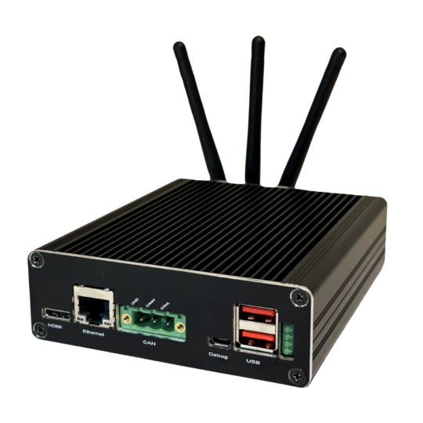
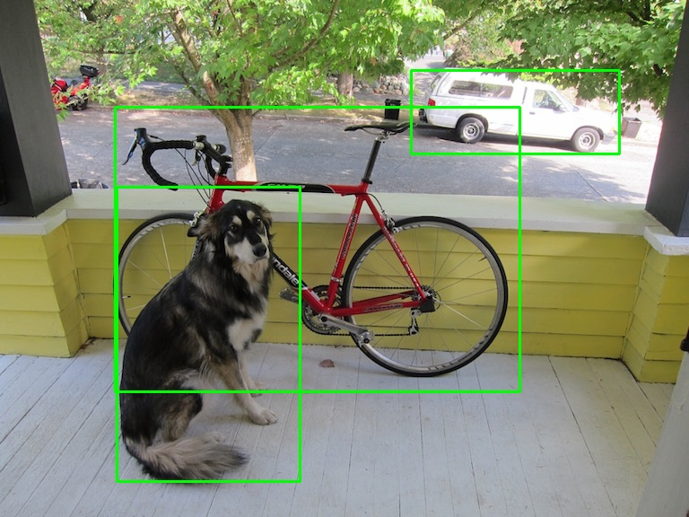

# Edge AI with cube:evk

<p align="center">
  
</p>

The **cube:evk** is powered by an i.MX8MPlus quad-core Arm® Cortex®-A53 processor running up to 1.8 GHz, with an integrated neural processing unit (NPU) delivering up to 2.3 TOPS for efficient on-device AI inference.

Beyond its processing performance, the **cube:evk** provides a comprehensive set of connectivity interfaces, including support for **V2X** technologies such as DSRC and C-V2X, making it well-suited for connected and intelligent edge applications.

More details about **cube:evk**: [https://cubesys.io/#product-section](https://cubesys.io/#product-section)

In this repository, we show an example project demonstrating image inference with bounding boxes using LiteRT (formerly TensorFlow Lite) on the **cube:evk**.

## Installation and Setup

### 1. Clone the repository

```bash
git clone https://github.com/cubesys-GmbH/tflite-inference-example.git
cd tflite-inference-example
```

### 2. Set up a Python virtual environment

It's recommended to use a virtual environment to isolate project dependencies.

#### On cube:evk
```bash
python3 -m venv venv
source venv/bin/activate
```

### 3. Install Requirements

```bash
pip install --upgrade pip
pip install -r requirements.txt
```

## Run It

### Verify VX Delegate

Ensure the VX delegate library is available on your cube:evk:

```bash
ls /usr/lib/libvx_delegate.so
```

### Run the Example

#### With VX Delegate (NPU accelerated)

```bash
python image_detection.py --input input/example.jpg --output output/result.jpg
```

#### CPU Only (disable delegate)

```bash
python image_detection.py --input input/example.jpg --output output/result.jpg --no-delegate
```

#### Example Result

<p align="center">
  
</p>

## License

This project is licensed under the MIT License. See [LICENSE](.LICENSE) for details.

## Contribution & Support

Contributions welcome — open a PR or issue. 
