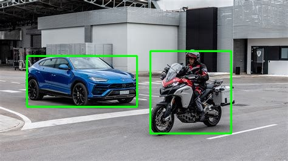

# Edge AI with cube:evk

<p align="center">
  
</p>

The **cube:evk** is powered by an i.MX8M Plus quad-core Arm Cortex-A53 (up to 1.8 GHz) with an integrated NPU delivering up to **2.3 TOPS** for on-device AI inference. It also exposes V2X interfaces (DSRC, C-V2X) for connected edge applications.

[Learn more about cube:evk](https://cubesys.io/#product-section)

## What This Example Does

Two example scripts demonstrate object detection with **SSD MobileNet v1** (quantized, ~4 MB, 80 COCO classes) on the cube:evk's NPU via the VX delegate (LiteRT, formerly TensorFlow Lite):

- **`image_detection.py`** — single-image inference. Reads an image, runs detection, writes an annotated copy to disk.
- **`live_detection.py`** — live USB-camera inference. Captures from a UVC webcam plugged into the board, runs detection on each frame, and serves the annotated stream as **MJPEG over HTTP** so you can view it from any browser on the LAN. The cube:evk is typically headless, so output is delivered over the network rather than a local display.

Both scripts:

1. Load the model with the **VX delegate** (NPU acceleration), or fall back to CPU with `--no-delegate`.
2. Resize the input to the model's **300 × 300** input tensor.
3. Filter detections by a configurable confidence threshold.
4. Draw bounding boxes on the output.

## Repository layout

```
tflite-inference-example/
├── detector/                              # detection + drawing helpers
│   ├── inference.py                       # Detector class, VX delegate handling
│   └── visualize.py                       # draw_bounding_box, draw_detections
├── models/
│   └── ssd_mobilenet_v1_1/
│       ├── ssd_mobilenet_v1_1.tflite      # bundled model (~4 MB, quantized)
│       └── labels.txt                     # 80 COCO classes
├── input/                                 # sample images
│   ├── image1.jpg
│   └── image2.jpg
├── output/                                # annotated images written here
├── docs/                                  # README assets
├── image_detection.py                     # entry point: single-image inference
├── live_detection.py                      # entry point: live USB-cam → MJPEG over HTTP
└── requirements.txt
```

## Installation

Run these commands directly on the cube:evk.

### 1. Clone the repository

```bash
git clone https://github.com/cubesys-GmbH/tflite-inference-example.git
cd tflite-inference-example
```

### 2. Create and activate a virtual environment

```bash
python3 -m venv venv
source venv/bin/activate
```

### 3. Install dependencies

```bash
pip install --upgrade pip
pip install -r requirements.txt
```

Installed packages: `numpy==1.26`, `opencv-python-headless`, `tflite-runtime`.

## Usage

### Verify the VX delegate is present

```bash
ls /usr/lib/libvx_delegate.so
```

If the file is missing, the scripts fall back to CPU and print a warning.

### Single-image inference — `image_detection.py`

#### Run with NPU acceleration (default)

```bash
python image_detection.py --input input/image2.jpg --output output/result.jpg
```

#### Run on CPU only

```bash
python image_detection.py --input input/image2.jpg --output output/result.jpg --no-delegate
```

#### Arguments

| Flag            | Default                                              | Description                                          |
| --------------- | ---------------------------------------------------- | ---------------------------------------------------- |
| `--input`       | `input/image2.jpg`                                  | Path to the input image.                             |
| `--output`      | `output/result.jpg`                                  | Path to write the annotated image (dir auto-created). |
| `--model`       | `models/ssd_mobilenet_v1_1/ssd_mobilenet_v1_1.tflite` | Path to the `.tflite` model.                         |
| `--labels`      | *(alongside model)*                                  | Path to `labels.txt`.                                |
| `--threshold`   | `0.6`                                                | Confidence threshold; detections below are dropped.  |
| `--no-delegate` | *(off)*                                              | Disable the VX delegate; run inference on CPU.       |

#### Expected output

```
VX delegate loaded (NPU acceleration enabled)
Interpreter warmup time: 0.XX sec
motorcyclist: 0.75  bbox=[0.31631243, 0.52312815, 0.82744515, 0.80242085]
car: 0.80  bbox=[0.34832233, 0.09315096, 0.66526, 0.47628003]
Inference complete in 0.XXX sec. Output saved at output/result.jpg
```

Compare warmup/inference times with and without `--no-delegate` to see the NPU speedup.

#### Example result

<p align="center">
  
</p>

### Live USB-camera streaming — `live_detection.py`

Plug a UVC-compatible USB webcam into the cube:evk's USB port, then start the streamer:

```bash
python live_detection.py
```

You should see something like:

```
VX delegate loaded (NPU acceleration enabled)
Interpreter warmup time: 0.XX sec
Streaming at http://192.168.x.x:8080/  (LAN access)
SSH tunnel from a remote host: ssh -L 8080:localhost:8080 <user>@<board>  then open http://localhost:8080/
~9.8 fps  inference=98.4 ms  detections=2
```

Open the printed URL in any browser on the same network. The page embeds an MJPEG stream at `/stream.mjpg`; multiple browsers can connect at once. Stop with `Ctrl-C`.

#### Viewing from a remote machine (SSH tunnel)

If the cube:evk isn't directly reachable on your network — or you'd rather not expose the port to the LAN — bind the server to localhost and forward through SSH:

```bash
# on the cube:evk
python live_detection.py --bind 127.0.0.1
```

```bash
# on your laptop
ssh -L 8080:localhost:8080 <user>@<cube-evk-ip>
# then open http://localhost:8080/ in your browser
```

#### Arguments

| Flag             | Default                                              | Description                                          |
| ---------------- | ---------------------------------------------------- | ---------------------------------------------------- |
| `--device`       | `0`                                                  | V4L2 device index (e.g. `0`) or path (e.g. `/dev/video0`). |
| `--width`        | `640`                                                | Capture width.                                       |
| `--height`       | `480`                                                | Capture height.                                      |
| `--bind`         | `0.0.0.0`                                            | HTTP bind address. Use `127.0.0.1` to require an SSH tunnel. |
| `--port`         | `8080`                                               | HTTP listen port.                                    |
| `--model`        | `models/ssd_mobilenet_v1_1/ssd_mobilenet_v1_1.tflite` | Path to the `.tflite` model.                         |
| `--labels`       | *(alongside model)*                                  | Path to `labels.txt`.                                |
| `--threshold`    | `0.5`                                                | Confidence threshold; detections below are dropped.  |
| `--jpeg-quality` | `80`                                                 | JPEG quality (1–100); lower = less bandwidth.        |
| `--no-delegate`  | *(off)*                                              | Disable the VX delegate; run inference on CPU.       |

## License

MIT — see [LICENSE](./LICENSE).

## Contribution & Support

Contributions welcome — open a PR or issue.
